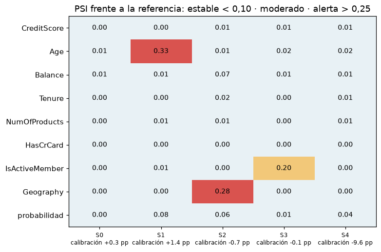

# Abandono bancario → decisiones de retención

[](https://github.com/darwinjaco/bank-churn-ml/actions/workflows/ci.yml)

[](LICENSE)

**Bank churn → retention decisions.** End-to-end ML system that turns a *calibrated* churn probability into a contact / no-contact decision with an explicit expected-profit rule: contact if p > c / (s·V) = 1/6. On a test set used exactly once, the frozen Random Forest reaches **AP 0.705** and **ROC-AUC 0.862** and, under illustrative assumptions, earns **€61,600 vs €22,100** for contacting everyone (60.5 % of the oracle). Built spec-first (6 specs) with preregistered hypotheses and thresholds, leakage-safe pipelines, MLflow, SHAP and a fairness audit, FastAPI + Streamlit, Docker and CI. A simulated drift study shows that a prevalence shift miscalibrates the model by −9.6 pp **without any input-drift alarm**.

**[Demo en vivo](https://huggingface.co/spaces/darwinjaco/bank-churn-ml)** (pendiente de publicar) · [API](#api) · [Ficha del modelo](reports/model_card.md) · [Especificaciones](specs/) · [Registro de avance](docs/registro-avance.md)

<!-- GIF de demo (20-30 s): docs/demo.gif o asset de un Release si supera 500 KB. -->

## Problema

Con un presupuesto de retención, ¿a qué clientes conviene contactar y cuánto dinero aporta el modelo frente a no contactar a nadie, contactar a todos o elegir al azar? El dataset ([*Churn Modelling*](https://www.kaggle.com/datasets/shrutimechlearn/churn-modelling), 10.000 clientes, 20,4 % de abandono) no trae valor del cliente ni costos de campaña: son **supuestos explícitos** (V = 1.000 €, c = 50 €, s = 30 %), no cifras observadas.

## Resultados (prueba, 2.000 clientes, una sola evaluación)

| Métrica | Valor |
|---|---|
| AP (PR-AUC, métrica principal) | **0,705** |
| ROC-AUC | 0,862 |
| Brier · log loss | 0,1017 · 0,338 |
| Probabilidad media frente a tasa observada | 20,5 % frente a 20,4 % |
| En el umbral 1/6: precisión · sensibilidad | 49,1 % · 76,4 % |

| Política | Contactados | Beneficio |
|---|---|---|
| Nadie | 0 | 0 € |
| Todos | 2.000 | 22.100 € |
| Aleatoria 20 % | 400 | 4.420 € |
| **Modelo (p > 1/6)** | **634** | **61.600 €** |
| Oráculo (cota superior) | 407 | 101.750 € |

En validación el modelo había obtenido AP 0,696 y 61.950 €: sin señales de sobreajuste. Las cifras se generan desde [`reports/final_test.json`](reports/final_test.json); el beneficio depende de los supuestos y no es una estimación causal.

## Arquitectura

```mermaid
flowchart LR
    U((Usuario)) --> ST["Streamlit<br/>dashboard"]
    ST -- HTTP --> API["FastAPI<br/>/predict · /explain · /monitoring"]
    API --> M["Random Forest + calibración sigmoide<br/>regla p &gt; 1/6"]
    API --> SH["SHAP<br/>3 razones por cliente"]
    API -. "opcional, ≤ 30 llamadas/h" .-> LLM["LLM compatible con OpenAI"]
    REL["GitHub Release model-v1.0<br/>model.joblib + SHA-256"] -- "build: descarga y verifica" --> API
    GH["GitHub: CI (Ruff + pytest ≥ 85 %)"] -- "etiqueta v* → deploy-space" --> HF["Hugging Face Space<br/>Docker, ROLE=all"]
```



- El dashboard **no carga el modelo**: todo pasa por la API ([spec 005](specs/005-api-and-dashboard.md)).
- El modelo no se versiona en Git: se publica como asset del Release y el build **falla si el SHA-256 no coincide**.
- En el Space solo el dashboard es público; la API escucha en `127.0.0.1` ([spec 006](specs/006-deployment-monitoring-release.md)).

## Cómo se construyó

| Etapa | Qué se hizo | Evidencia |
|---|---|---|
| Contrato y división | Pandera; 60/20/20 estratificado (semilla 42) con manifiesto de hashes antes del EDA | [spec 001](specs/001-overview-and-data-contract.md), [manifiesto](reports/split_manifest.json) |
| EDA | Seis hipótesis preregistradas con IC 95 % y Holm: inactividad +12 pp, productos no monótonos, Alemania OR 2,18, edad en U invertida | [reporte](reports/eda_hypotheses.md) |
| Modelado | Pipelines sin fuga; Dummy/LogReg → RF/XGBoost; búsqueda (FASE A) y re-evaluación en pliegues nuevos 5×2 (FASE B); MLflow | [selección](reports/model_selection.md) |
| Calibración y decisión | Sigmoide elegida por Brier (E-04); umbral analítico c/(s·V), sin ajustarlo con datos | [decisión](reports/decision.md) |
| Auditoría | SHAP global y local, perfiles de error, segmentos y E-01 por género (solo auditoría) | [auditoría](reports/audit.md) |
| Prueba | Una única evaluación con todo congelado | [ficha del modelo](reports/model_card.md) |
| Serving | FastAPI, Streamlit, Docker, LLM opcional con límite | [spec 005](specs/005-api-and-dashboard.md) |
| Monitoreo | PSI + KS/chi² en cinco escenarios simulados, expectativas preregistradas | [monitoreo](reports/monitoring.md) |

## Monitoreo simulado de cambios de distribución

Referencia = entrenamiento; actual = validación remuestreada (nunca la prueba). Umbrales fijados antes de ejecutar: PSI > 0,25 = alerta; degradación = calibración global fuera de ±3 pp o Brier > 1,15 × S0.



- **E1 cumplida:** sin cambio (S0), sin alarmas ni degradación.
- **E2 no cumplida:** el envejecimiento (S1, PSI 0,33) y el doble de clientes alemanes (S2, 0,28) disparan alarma, pero pasar del 48 % al 70 % de inactivos (S3) da PSI 0,20. La nota a priori de la spec ya lo anticipaba (≈ 0,20): el umbral de 0,25 es poco sensible en variables binarias.
- **E3 cumplida, la lección principal:** con la prevalencia del 20 % al 35 % (S4), ninguna variable supera PSI 0,03, pero el modelo queda descalibrado en −9,6 pp. Monitorear entradas no basta; hacen falta etiquetas.
- **E4 cumplida:** la tasa de contacto se mueve entre +3,8 y +11,1 pp; es una señal útil sin etiquetas.

## Decisiones técnicas

| Decisión | Motivo |
|---|---|
| AP (PR-AUC) como métrica principal | Clase minoritaria del 20 %; importa ordenar bien a quienes se van |
| Random Forest y no XGBoost | XGBoost gana por 0,011 de AP, menos que la desviación entre pliegues (0,018): parsimonia |
| Sin `EstimatedSalary` | E-03: quitarla no empeora (+0,003 ± 0,004); coherente con H6 (AUC 0,51) |
| Calibración sigmoide | E-04: mejor Brier en validación; la decisión usa probabilidades, no rankings |
| Umbral analítico 1/6 | Sale de la economía (c/(s·V)), no se ajusta a los datos: evita sobreajustar el umbral |
| `Gender` nunca como variable | Solo auditoría (E-01); excluirla no garantiza equidad y se mide |
| Sin red neuronal | 10.000 filas tabulares, donde los ensambles de árboles son la referencia; no se evaluó (desviación registrada del plan inicial) |
| FastAPI + Streamlit separados | Un solo punto de inferencia validado por contrato (Pydantic, `Gender` → 422) |
| PSI propio y no Evidently | Ligero, determinista y testeable; estándar en riesgo de crédito |
| Modelo por Release + SHA-256 | El binario no entra en Git y cualquier build verifica que sirve el artefacto evaluado |

## Limitaciones

- **Datos probablemente sintéticos** (patrones de productos 3–4 y salario uniforme); los resultados no se trasladan sin más a un banco real.
- **Sin causalidad ni uplift:** el modelo predice quién se va, no a quién cambia la llamada; s = 30 % es un supuesto igual para todos.
- **Brecha E-01:** con igual tasa de contacto y sensibilidad entre géneros, la precisión es 59,6 % (mujeres) frente a 42,2 % (hombres), por tasas base distintas.
- **Grupo de 3–4 productos** (~3 % de clientes) aporta ~0,08 de AP; los abandonos no detectados son sobre todo jóvenes y activos (18–29 años: 65 % sin contactar en validación).
- **Demo** sin autenticación; el Space gratuito se suspende tras inactividad (primer acceso lento). El monitoreo es una simulación sobre validación, no producción.

## Trabajo futuro

Presupuesto por deciles y análisis de sensibilidad de los supuestos (opciones B y C de la [spec 004](specs/004-decision-layer.md)); mitigación de E-01; uplift con datos de tratamiento; monitoreo con etiquetas reales; migrar `penalty="l2"` de LogisticRegression (obsoleto desde scikit-learn 1.9; se elimina en la 1.10).

## Inicio rápido

Requisitos: Git y [uv](https://docs.astral.sh/uv/) (Python 3.11 fijado en `.python-version`). Docker es opcional.

```powershell
git clone https://github.com/darwinjaco/bank-churn-ml.git
Set-Location bank-churn-ml
uv sync --locked --all-groups
uv run pytest --cov=churn --cov-fail-under=85   # datos sintéticos; no necesita el CSV
```

**Demo local con Docker** (descarga el modelo del Release y verifica su hash):

```powershell
docker compose up --build
# Dashboard: http://localhost:8501   API: http://localhost:8000/docs
pwsh -File scripts/verify-docker.ps1   # verificación automática: build, /predict, 422 con Gender, dashboard
```

**Sin Docker:**

```powershell
uv run python -m churn.artifact          # descarga models/model.joblib y verifica el SHA-256
uv run uvicorn churn.api:app --port 8000
uv run streamlit run dashboard/app.py    # en otra terminal
```

Para probar el lote, sube [`examples/clientes_ejemplo.csv`](examples/clientes_ejemplo.csv): 20 clientes **sintéticos** generados con semilla por `scripts/make_example_csv.py`.

**LLM opcional** para `/explain`: copia `.env.example` a `.env` (no se versiona) con `LLM_BASE_URL`, `LLM_API_KEY` y `LLM_MODEL` de un proveedor compatible con OpenAI (NVIDIA NIM, OpenRouter). `LLM_MAX_CALLS_PER_HOUR` (30 por defecto) limita el gasto. Solo se envían las variables del contrato y las razones del modelo, nunca identificadores; ante cualquier fallo o límite responde una plantilla.

### Reproducir el pipeline

El CSV no se distribuye: descárgalo de Kaggle a `data/raw/Churn_Modelling.csv`.

```powershell
uv run churn-validate --out reports/data_quality.json
uv run churn-split            # división y manifiesto (semilla 42)
uv run churn-hypotheses       # H1-H6
uv run churn-baselines        # Dummy y LogReg con MLflow
uv run churn-tune             # FASE A + FASE B (~8 min con 2 núcleos)
uv run churn-select           # regla de selección, E-02 y E-03
uv run churn-decide           # E-04, umbral y artefacto en models/
uv run churn-audit            # SHAP, errores, segmentos y E-01
uv run churn-monitor          # monitoreo simulado (spec 006)
```

`churn-final` (evaluación en prueba) ya se ejecutó una vez y falla si se repite: es una protección deliberada. MLflow: `uv run mlflow ui --backend-store-uri sqlite:///mlruns/mlflow.db`.

## API

| Endpoint | Uso |
|---|---|
| `GET /health` | Estado y SHA-256 del artefacto |
| `GET /model` | Variables, umbral, supuestos y evaluación final |
| `POST /predict` | Probabilidad calibrada, contactar sí/no, beneficio esperado y 3 razones SHAP |
| `POST /predict/batch` | Hasta 1.000 clientes y resumen de contactados y beneficio |
| `POST /explain` | Explicación en texto (LLM opcional con límite; si no, plantilla) |
| `GET /monitoring` | Reporte del monitoreo simulado |

La entrada se valida con el contrato de datos: rangos, categorías conocidas y números finitos; `Gender` o identificadores devuelven **422**. Documentación interactiva en `/docs` al ejecutar la API localmente.

## Estructura

```text
specs/        Especificaciones 001-006 (diseño antes de implementar)
src/churn/    Contrato, división, EDA, pipelines, ajuste, calibración, decisión, SHAP,
              auditoría, artefacto, API, interfaz y monitoreo
dashboard/    Streamlit (solo consume la API)
tests/        Tests con datos sintéticos (CI no necesita el CSV)
reports/      Reportes JSON/Markdown generados por código y figuras
scripts/      Verificación Docker, armado del Space y CSV de ejemplo
deploy/space/ README del Space de Hugging Face
docs/         Registro de avance, planes semanales e historial
```

## Forma de trabajo

Desarrollo guiado por especificaciones: ninguna línea de `src/` sin spec y plan versionados ([AGENTS.md](AGENTS.md)). Hipótesis, reglas de selección, umbrales y expectativas se **preregistran**; los cambios son enmiendas con motivo. La partición de prueba se usó una sola vez. El [registro de avance](docs/registro-avance.md) distingue verificación local, CI remoto y despliegue; el [historial semanal](docs/historial-semanal.md) conserva los resúmenes de cada semana.

## Licencia y datos

Código y documentación bajo [licencia MIT](LICENSE). El dataset está sujeto a las condiciones de su fuente en Kaggle y se obtiene por separado; nunca se publica en el repositorio, la imagen ni el Space.
